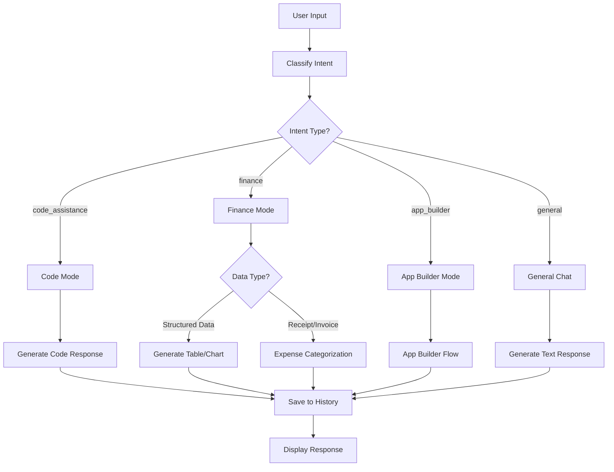
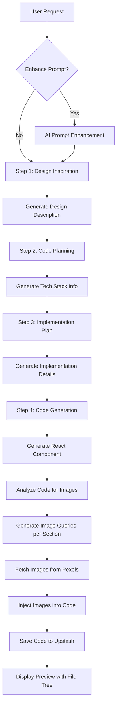
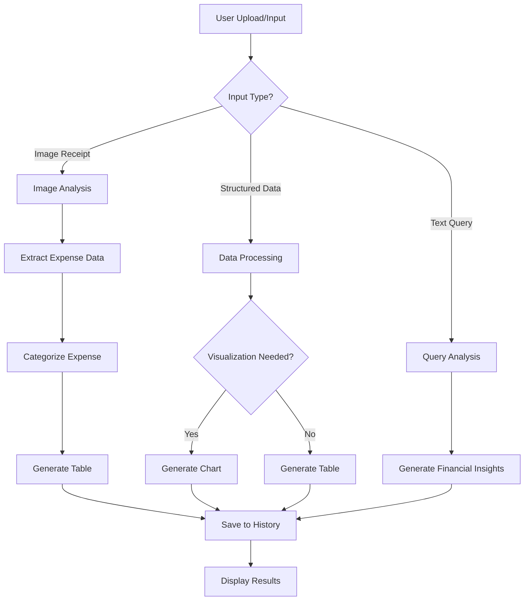
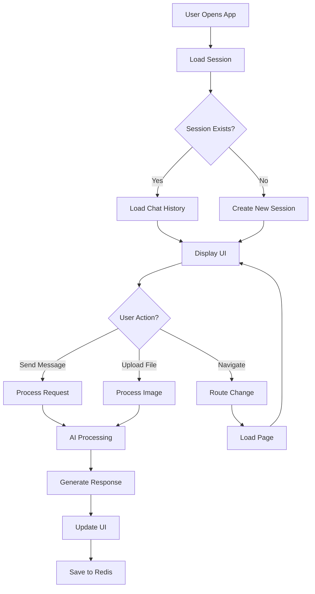

# Luminite AI

**Author:** Alexander Agung  
**GitHub:** [XceedZ](https://github.com/XceedZ)  
**Version:** 1.3.1

Luminite AI adalah platform AI assistant yang dirancang khusus untuk membantu UMKM (Usaha Mikro, Kecil, dan Menengah) di Indonesia dalam hal coding dan manajemen keuangan. Platform ini menyediakan berbagai fitur canggih menggunakan teknologi AI terbaru untuk meningkatkan produktivitas dan efisiensi bisnis.

## 📋 Tentang Aplikasi

Luminite AI adalah aplikasi web berbasis Next.js yang menyediakan berbagai fitur AI-powered untuk membantu pengguna dalam:

- **Coding Assistance**: Bantuan pemrograman, code review, debugging, dan solusi teknis
- **Financial Management**: Kategorisasi pengeluaran, analisis arus kas, visualisasi data keuangan
- **Web App Builder**: Generator website modern menggunakan React/Next.js dan Shadcn UI
- **Character Studio**: Tools untuk membuat dan mengelola karakter AI
- **Data Analytics**: Dashboard dan visualisasi data untuk insights bisnis

## ✨ Fitur Utama

### 1. **Quick Create (AI Assistant)**
- Chat AI yang dapat membantu dengan berbagai tugas coding dan keuangan
- Support untuk multiple languages (Bahasa Indonesia & English)
- Image upload untuk analisis dokumen (nota, invoice, dll)
- Real-time response generation dengan streaming
- Chat history management dengan session-based storage

### 2. **App Builder**
- Generator website modern dengan React/Next.js components
- Menggunakan Shadcn UI components dan Tailwind CSS
- **Prompt Enhancement**: Fitur AI untuk memperbaiki dan memperdetail prompt pengguna
- Auto-injection gambar dari Pexels API dengan analisis per-section
- Live preview dengan iframe rendering
- Code export dan preview functionality
- File tree view untuk navigasi kode yang lebih baik
- Resizable panels untuk code editor
- Basic icon library (lucide-react) tersedia secara global

### 3. **Character Studio**
- Tools untuk membuat dan mengelola karakter AI
- Custom character creation dengan berbagai parameter

### 4. **Dashboard**
- Overview data dan analytics
- Visualisasi data dengan charts dan tables
- Quick access ke berbagai fitur

### 5. **Financial Management**
- Kategorisasi pengeluaran otomatis dari gambar nota/invoice
- Analisis arus kas (cashflow)
- Visualisasi data keuangan dengan charts interaktif
- Tabel data terstruktur untuk laporan keuangan

### 6. **Internationalization (i18n)**
- Support untuk Bahasa Indonesia dan English
- Language switching dengan cookie/localStorage
- File-based translation system

## 🛠️ Tech Stack

### Frontend
- **Next.js 15.5.2** - React framework dengan App Router
- **React 19.1.1** - UI library
- **TypeScript 5.9.2** - Type-safe JavaScript
- **Tailwind CSS 4.1.13** - Utility-first CSS framework
- **Shadcn UI** - Component library berbasis Radix UI
- **Zustand 5.0.8** - State management
- **Recharts 3.1.2** - Chart library untuk visualisasi data

### Backend & Services
- **Google GenAI SDK** - AI model integration (Gemma models)
- **Upstash Redis** - Serverless Redis untuk data storage
- **Next.js Server Actions** - Server-side API handlers

### UI Components & Libraries
- **Radix UI** - Unstyled, accessible component primitives
- **Lucide React** - Icon library
- **Tabler Icons** - Additional icon set
- **Sonner** - Toast notification library
- **React Markdown** - Markdown rendering
- **dnd-kit** - Drag and drop functionality

### Development Tools
- **Turbopack** - Next-generation bundler
- **ESLint** - Code linting
- **TypeScript** - Type checking

## 🚀 Getting Started

### Prerequisites
- Node.js 18+ 
- npm, yarn, atau pnpm
- Upstash Redis account (untuk data storage)
- Google AI API key (untuk AI features)
- Pexels API key (untuk image features di App Builder)

### Installation

1. **Clone repository**
```bash
git clone https://github.com/XceedZ/luminite-ai.git
cd luminite-ai
```

2. **Install dependencies**
```bash
npm install  
# atau
yarn install  
# atau
pnpm install  
```

3. **Setup environment variables**
Buat file `.env.local` di root directory:
```env
# Google AI API
GOOGLE_API_KEY=your_google_ai_api_key
GEMINI_API_KEY=your_gemini_api_key

# Upstash Redis
UPSTASH_REDIS_REST_URL=your_upstash_redis_url
UPSTASH_REDIS_REST_TOKEN=your_upstash_redis_token

# Pexels API (untuk App Builder)
PEXELS_API_KEY=your_pexels_api_key
```

4. **Run development server**
```bash
npm run dev  
# atau
yarn dev
# atau
pnpm dev
```

5. **Open browser**
Navigate ke **http://localhost:3000**

### Build for Production

```bash
npm run build
npm start
```

## 📂 Project Structure

```
luminite-ai/
├── app/                          # Next.js App Router pages
│   ├── (preview)/               # Preview route group (isolated layout)
│   │   └── app-builder-preview/ # App builder preview routes
│   ├── dashboard/               # Dashboard module
│   ├── playground/              # Playground modules
│   │   ├── app-builder/         # App Builder feature
│   │   └── character-studio/    # Character Studio feature
│   ├── quick-create/            # Quick Create AI chat
│   ├── locales/                # i18n translation files
│   │   ├── en.json             # English translations
│   │   └── id.json             # Indonesian translations
│   ├── layout.tsx               # Root layout
│   └── globals.css              # Global styles
├── components/                  # React components
│   ├── ui/                     # Shadcn UI components
│   ├── customized/             # Custom components
│   ├── sections/               # Section components
│   ├── panel-code.tsx          # Code display component
│   ├── nav-*.tsx              # Navigation components
│   └── ...
├── lib/                        # Library & utilities
│   ├── actions/                # Server actions
│   │   └── ai.ts               # AI-related server actions
│   ├── utils/                  # Utility functions
│   │   └── react-to-html.ts    # React to HTML converter
│   └── templates/              # Template files (optional)
├── app/store/                  # Zustand stores
│   └── ai-store.ts             # AI state management
├── config/                     # Configuration files
│   └── nav.ts                  # Navigation configuration
├── public/                     # Static assets
├── package.json               # Dependencies
├── tsconfig.json              # TypeScript config
├── tailwind.config.ts         # Tailwind config
└── README.md                  # This file
```

## 🔄 Application Flow

### 1. Quick Create (AI Chat) Flow



### 2. App Builder Flow



### 3. Financial Management Flow



### 4. General Application Flow



## 🎯 Key Features Detail

### AI Capabilities
- **Intent Classification**: Otomatis mengklasifikasikan user intent (code, finance, app_builder, general)
- **Multi-language Support**: Bahasa Indonesia dan English
- **Context-aware Responses**: Memahami konteks dari conversation history
- **Image Analysis**: Analisis gambar untuk expense categorization
- **Code Generation**: Generate React/Next.js components dengan Shadcn UI
- **Data Visualization**: Generate charts dan tables dari data
- **Prompt Enhancement**: AI-powered prompt improvement untuk App Builder - memperbaiki dan memperdetail prompt pengguna secara otomatis
- **Smart Image Injection**: Analisis kode yang di-generate dan inject gambar yang relevan per section dari Pexels API

### State Management
- **Zustand Store**: Centralized state management untuk AI features
- **Session Management**: Session-based chat history
- **Real-time Updates**: Streaming responses untuk better UX

### Data Storage
- **Upstash Redis**: 
  - Chat history storage
  - Session management
  - Code storage untuk App Builder
  - AI steps tracking

## 🔧 Configuration

### Environment Variables
Semua environment variables harus diset di `.env.local`:

- `GOOGLE_API_KEY`: Google AI API key
- `GEMINI_API_KEY`: Gemini API key (alternatif)
- `UPSTASH_REDIS_REST_URL`: Upstash Redis REST URL
- `UPSTASH_REDIS_REST_TOKEN`: Upstash Redis token
- `PEXELS_API_KEY`: Pexels API key untuk image features

### Navigation Configuration
Edit `config/nav.ts` untuk mengubah navigation structure.

### i18n Configuration
Translation files ada di `app/locales/`:
- `en.json` - English translations
- `id.json` - Indonesian translations

## 📚 Learn More

- [Next.js Documentation](https://nextjs.org/docs)  
- [Shadcn UI Documentation](https://ui.shadcn.com)
- [Google GenAI SDK](https://ai.google.dev/docs)
- [Upstash Redis](https://docs.upstash.com/redis)
- [Tailwind CSS](https://tailwindcss.com/docs)
- [Zustand](https://zustand-demo.pmnd.rs/)

## 📖 Documentation

- [App Builder Prompt Examples](./docs/APP_BUILDER_PROMPTS.md) - Panduan lengkap contoh prompt yang efektif untuk App Builder

## 🤝 Contributing

Contributions are welcome! Please feel free to submit a Pull Request.

## 📝 License

This project is private and proprietary.

## 👤 Author

**Alexander Agung**  
GitHub: [@XceedZ](https://github.com/XceedZ)

---

Made with ❤️ for Indonesian SMEs
